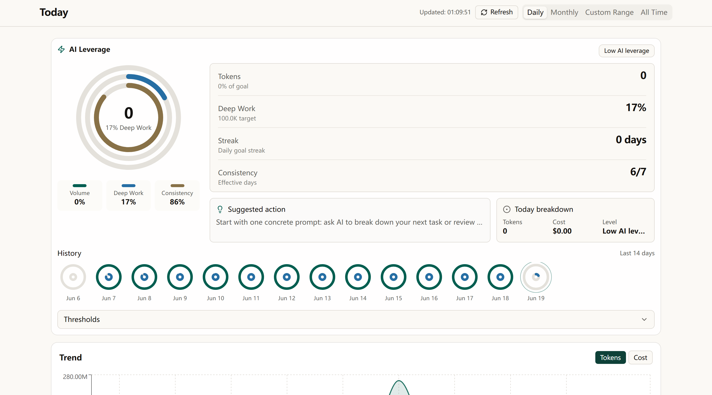
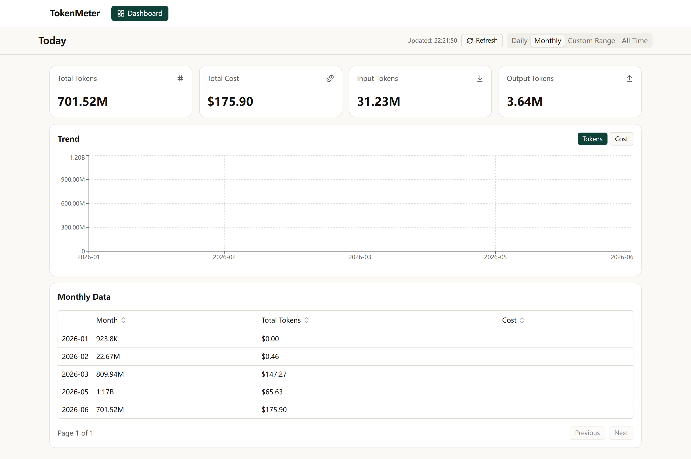
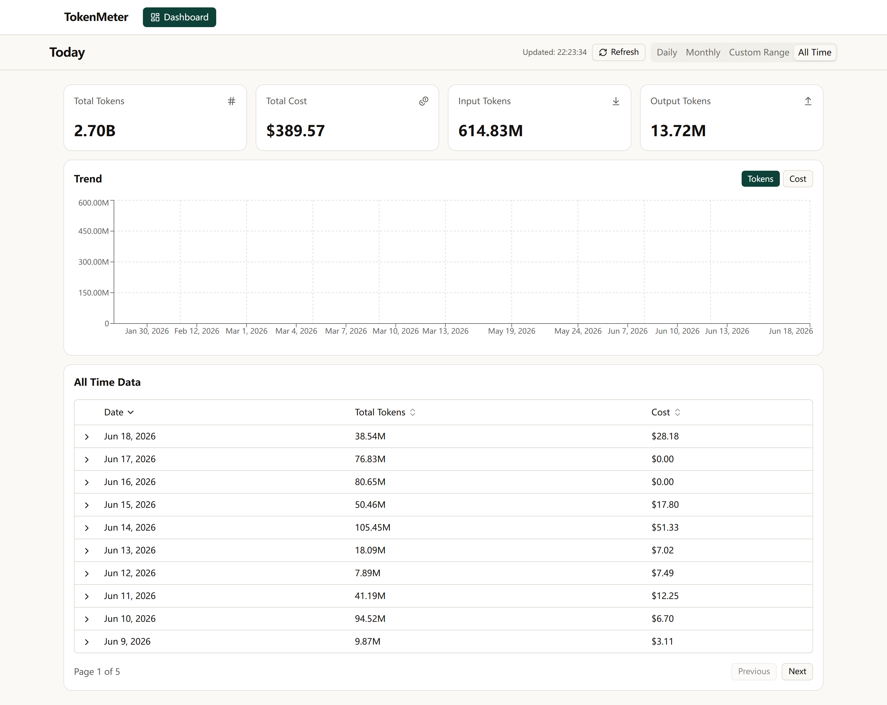
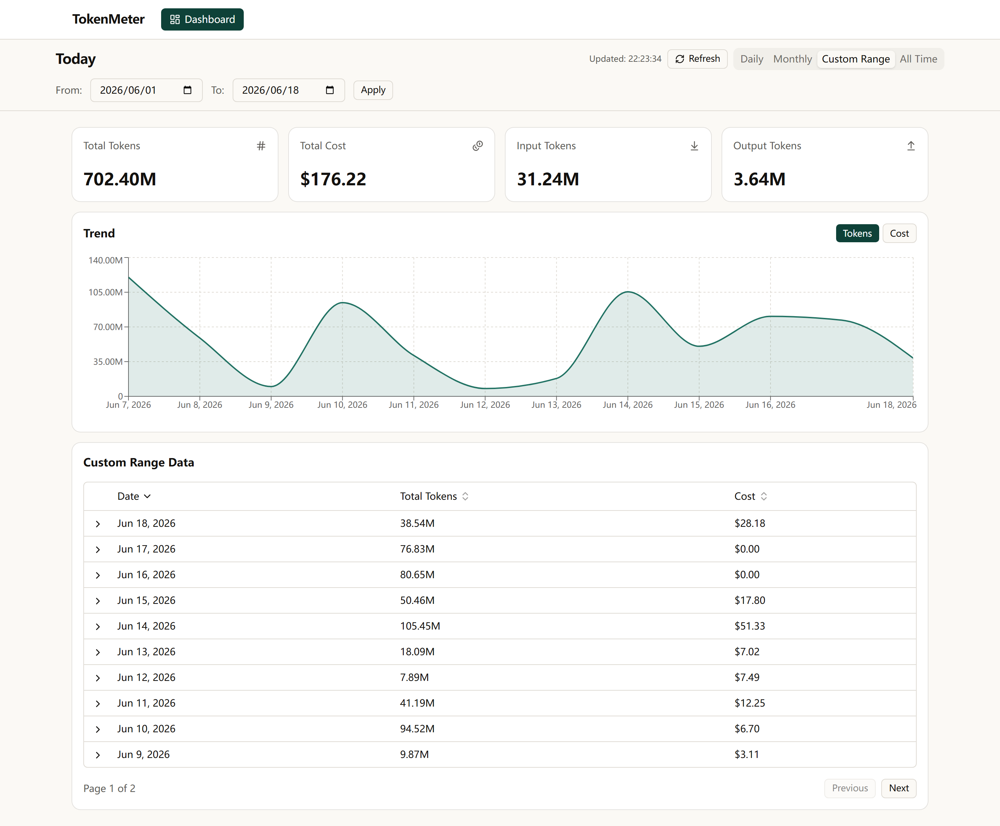

# Tokboard

> A local-first token consumption dashboard for Claude Code and other AI CLI
> workflows. One command, no account, no cloud dependency.

<p align="left">
  <a href="https://github.com/SanQianX/Token-Consumption-Leaderboard/actions/workflows/ci.yml"></a>
  <a href="https://www.npmjs.com/package/token-leaderboard"></a>
  <a href="https://nodejs.org"></a>
  <a href="LICENSE"></a>
</p>



## Why Tokboard?

Tokboard turns local JSONL usage logs from Claude Code into a clean browser
dashboard. It runs a tiny local process, uses
[`ccusage`](https://github.com/ryoppippi/ccusage) for usage aggregation, and
renders daily, monthly, custom-range, and all-time views.

- **Local-first**: runs on your machine at `localhost`, with no hosted account.
- **Read-only**: never modifies your Claude Code logs.
- **Private by default**: usage data stays on your laptop.
- **Fast to install**: one npm package, Node.js 18+, no extra setup.
- **Transparent**: Apache-2.0 source, documented release process, and public CI.

## Quick Start

```bash
npm install -g token-leaderboard
tokboard
```

Tokboard starts in the background and opens <http://localhost:7842>. If that
port is busy, it automatically uses the next available port in the configured
range.

You can also try it without a global install:

```bash
npx token-leaderboard
```

## Commands

| Command | What it does |
| --- | --- |
| `tokboard` | Start in the background and open the dashboard |
| `tokboard stop` | Stop the background process |
| `tokboard status` | Show whether Tokboard is running |
| `tokboard --fg` | Run in the foreground for debugging |
| `tokboard --port 8080` | Use a specific port |
| `tokboard --no-open` | Start without opening a browser |
| `tokboard -h` | Show CLI help |
| `tokboard -v` | Print the installed version |

## Screenshots

| Daily | Monthly |
| :---: | :---: |
|  |  |
| AI Leverage, live tokens, history, and trend chart. | Monthly totals with token/cost trend switching. |

| All Time | Custom Range |
| :---: | :---: |
|  |  |
| Every recorded usage day, paginated and sortable. | Pick a window for sprint reviews or weekly check-ins. |

## Privacy Model

Tokboard reads local Claude Code project logs under `~/.claude/projects/` and
serves a local dashboard from your machine. It does not require a Tokboard
account, cloud backend, telemetry service, hosted database, or API key.

The app is designed as a local OSS tool. Future hosted or enterprise services,
if built, should live outside this repository unless they are explicitly opened.
See [docs/OPEN_SOURCE_BOUNDARY.md](docs/OPEN_SOURCE_BOUNDARY.md).

## Timezone Behavior

Tokboard reads your system timezone with
`Intl.DateTimeFormat().resolvedOptions().timeZone` and passes it to `ccusage`
via `--timezone`, so daily buckets roll over at midnight in your local calendar
instead of UTC. If your system timezone changes, the next refresh rebuilds the
daily cache with the new timezone.

## Development

Requirements:

- Node.js 18+
- pnpm 9+

```bash
pnpm install
pnpm dev
```

Useful checks before opening a pull request:

```bash
pnpm check
```

`pnpm check` builds the app and runs an npm package dry run from
`packages/local-app`, which catches stale build output and packaging mistakes.

## Release

Publishing is automated through GitHub Actions. Maintainers publish by pushing a
version tag such as `v2.4.1`; the workflow builds the package and publishes it
to npm with `NPM_TOKEN`.

Do not run `npm publish` manually from a local machine.

## Contributing

Issues and pull requests are welcome. Please read
[CONTRIBUTING.md](CONTRIBUTING.md) before proposing larger changes, especially
changes that touch privacy behavior, packaging, or the open-source boundary.

Security reports should follow [SECURITY.md](SECURITY.md).

## License

Apache-2.0. See [LICENSE](LICENSE) and [NOTICE](NOTICE).
